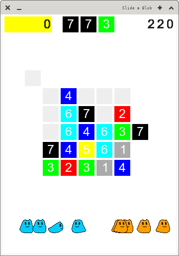

# Slide a Blob



Slide a Blob is a simple clone for the old ICQ game Slide a Lama.

*Still work in progress, currently paused.*

## Build

```
git clone https://github.com/Noxsense/SlideABlob.git ./SlideABlob
cd ./SlideABlob
make
```

Then the executable `./output/SlideABlob` and a desktop file
`./output/SlideABlob.desktop` will appear and be executable.


## Used references:

- game Characteristics [video](https://youtu.be/CXQXQgVflCI)

- all images drawn by myself (Nox)
